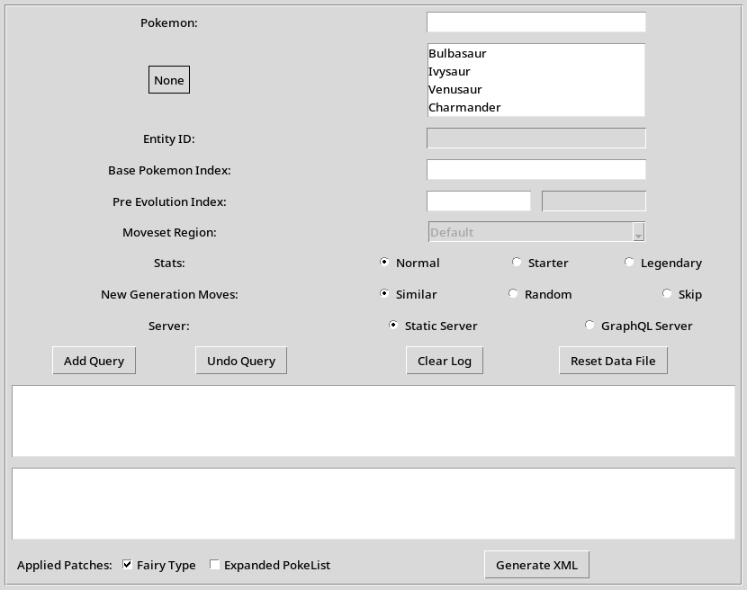

# Pokemon XML Generator

Generates XML files for all Pokémon, whether new or old, in a format importable by Skytemple.

## Data Generated

1. Pokémon Data
2. Moves Data
3. Abilities
4. Evolution Data
5. Mystery Dungeon Meta Data
6. Base Stats
7. Stat Growth (planned not implemented yet)
8. Exp Curve (planned not implemented yet)

**Note:** This tool doesn't cover exclusive items, so you'll need to handle those yourself.

## Usage

### Windows

**Executable**:

-   Download the executable file from the [Releases](https://github.com/WraithFire/xmlgenerator/releases) tab.
-   Place the executable in a separate folder.
-   Run the executable. The initial run will generate `pokemon_data.py` and a `pokemon_xml` folder.

**Run from Source**:

-   Follow the instructions for Mac/Linux.

### Mac/Linux

**Run from Source**:

-   Clone the repository using `git clone https://github.com/WraithFire/xmlgenerator.git`.
-   If you're unable to use git, you can download the repository as a ZIP file from [HERE](https://github.com/WraithFire/xmlgenerator/archive/refs/heads/master.zip). After downloading, unzip it.
-   Navigate to the directory.
-   Make sure you have Python installed on your system.
-   Run the script with `python pokemon.py`.
-   The initial run will generate a `pokemon_xml` folder.

### Tool Usage



-   Select the Pokémon you want to generate XML for.
-   Add the selected Pokémon to the generation queue by clicking "Add Query". You can add multiple queries.
-   Click on "Generate XML" to create the XML files.
-   The generated XML will be located in the `pokemon_xml` folder.

**Note:** This tool generates data, which is available on PokeAPI. So, it's always a good idea to double-check if all the information is correct.

### Advanced Usage

**Customization**

You have the flexibility to modify all data in `pokemon_data.py` according to your needs. For example, if you added a new move in slot 404, simply change the line:

```python
# {"ID": "404", "Move": "[M:D1]", "Power": 2},
```

to:

```python
{"ID": "404", "Move": "Your Move Name", "Power": "Your Move Power"},
```

and voila! The generator will now assign your new moves. The same principle applies to abilities, HM TM, and other data as well.

**Note:** Ensure that the move name matches exactly with the reference in moves.txt. The same principle applies to abilities; make sure they match the entries in abilities.txt.

**Mass XML Generator**

Place the `queries_data.py` alongside the executable or `pokemon.py` if you are running from the source.

Open the generator and select the appropriate patches applied. Then, click on "Generate XML," and it will create XML files for all the Pokémon.

**Warning:** There are over 1300 of them, so be prepared!
